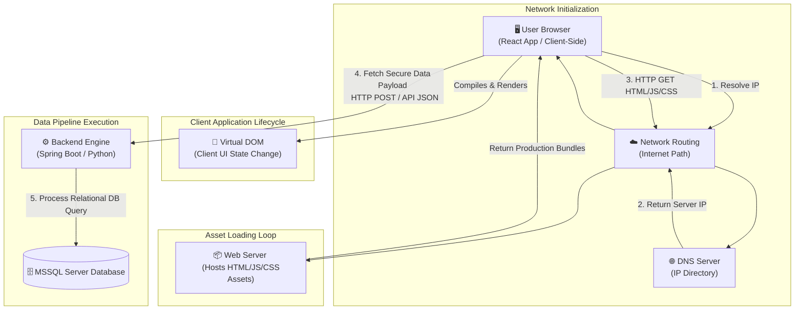

# UI Core Basics & Web Fundamentals

Foundational principles of user interfaces and the underlying network layers that drive the web.

---

## UI vs UX: The Core Distinction

In full-stack interviews, engineers often blur these lines. Interviewers look for architectural clarity on how product design dictates front-end engineering implementation.

<b>What is the difference between UI and UX?</b>

*   **UI (User Interface):** The structural, visual, and interactive elements of a product. It focuses strictly on what the user **sees and interacts with directly** (e.g., typography, buttons, layout spacing, input forms, colors, dark mode toggles). It is a tactical implementation.
*   **UX (User Experience):** The complete internal **feeling and efficiency** a user encounters when traversing an application. It focuses on the user journey, accessibility, ease of use, information architecture, and reducing cognitive friction (e.g., *"How many clicks does it take a user to checkout?"*). It is a strategic philosophy.

> **Analogy:** Think of an automobile. The **UI** is the physical dashboard, the leather steering wheel, the pedal placement, and the touchscreen layout. The **UX** is how smooth the car turns, how intuitive it feels to shift gears, and whether the driver feels safe and comfortable.

---

## Building Blocks of UI Development

The web browser natively understands three core technologies. Together, they form the Document Object Model (DOM) runtime.

### The Core Trilogy
*   **HTML (HyperText Markup Language):** The raw **skeleton and semantic structure** of the page (e.g., headings, paragraphs, structural divs).
*   **CSS (Cascading Style Sheets):** The visual **skin, layout alignment, and presentation layer** applied to the structure (e.g., colors, padding, Flexbox/Grid systems).
*   **JavaScript (JS):** The engine of **behavior, client-side state machine management, and dynamic manipulation** of the HTML skeleton.

<b>How do these building blocks work together in a browser?</b>

When a browser loads a web page, it executes a pipeline known as the **Critical Rendering Path (CRP)**:
1. **DOM Construction:** The browser parses raw HTML strings into a tree node structure called the **DOM (Document Object Model)**.
2. **CSSOM Construction:** The browser parses linked CSS sheets and inline style tags into a tree called the **CSSOM (CSS Object Model)**.
3. **Render Tree:** The browser combines DOM and CSSOM into a unified **Render Tree**, tracking only elements visible on the screen.
4. **Layout (Reflow):** The browser calculates the exact geometric size and pixel positioning coordinates of each visible node.
5. **Paint:** The browser fills in individual pixels (colors, textures, text rendering) onto the screen.

JavaScript can intercept this chain at any moment by directly querying the DOM API to modify nodes, which triggers a localized recalculation of layout and paint phases.

---

## The Internet Fundamentals

Before any UI can render, the files must traverse the physical globe. Understanding network routing infrastructure is mandatory for troubleshooting full-stack network latency.

<b>How does the Internet work? (Servers, Routers, and Protocols)</b>

The Internet is fundamentally a massive, decentralized global network of interconnected physical computers communicating over wires.

*   **Servers:** High-powered, always-on computers sitting in data centers whose sole purpose is to listen for incoming data requests and serve up response files (like HTML files or raw JSON payloads).
*   **Routers:** Specialized traffic-directing network hardware appliances. When your computer sends out a data packet, routers read its destination address and decide the fastest physical pathway across global fiber cables to pass it along.
*   **Protocols:** The strict, mutually agreed-upon behavioral rules governing how data must be packaged, addressed, checked for errors, and sent across the wire (e.g., **IP** handles addressing, **TCP** ensures safe, ordered delivery via a 3-way handshake).

<b>What is the difference between Client-Side and Server-Side?</b>

*   **Client-Side:** Code execution that occurs natively **inside the end-user's local environment** (typically their web browser or mobile application). Your React components, button event listeners, and UI styling are executed entirely on the client's local CPU.
*   **Server-Side:** Operations that occur **remotely on data center hardware** far away from the user. Fetching a user record from a relational database, checking authentication tokens, or computing complex financial analytics happen completely behind closed doors on the server before sending a final payload back over the wire.

<b>Explain DNS (Domain Name System) and Hosting.</b>

*   **DNS (Domain Name System):** The phonebook of the global internet. Computers communicate via unique numeric IP addresses (e.g., `192.0.2.1`). Humans prefer semantic domain strings (e.g., `github.com`). When you enter a URL, your browser shoots a quick background request to a **DNS Server** to translate that human string into a machine-routable IP address.
*   **Hosting:** The physical rental space on a server. When you "host" your site (e.g., on GitHub Pages, AWS S3, or Vercel), you are simply uploading your HTML/CSS/JS file assets onto their remote hard drives so they are universally accessible online.

---

## The Web Infrastructure

The Web is a software system built on top of the physical infrastructure of the Internet.

<b>Browsers, URLs, and HTTP vs HTTPS</b>

*   **Browsers:** Software programs (like Chrome, Firefox, Safari) whose primary job is to fetch resources from a server, parse their technical instructions, and compile them into a human-interactive visual screen.
*   **URL (Uniform Resource Locator):** The complete formatted web address string used to pinpoint a unique asset or document online. It breaks down into:
    `https://` (Protocol) + `fullstack-nexus.com` (Domain/Host) + `/ui/basics` (Path to file resource).
*   **HTTP vs HTTPS:** HTTP (HyperText Transfer Protocol) is the raw text protocol used to swap packets between browser and server. **HTTPS** is the identical protocol wrapped inside a secure **SSL/TLS cryptographic envelope**. This encrypts your request bodies and headers so malicious entities on your Wi-Fi network cannot sniff passwords or query payloads.

<b>HTTP Methods: GET vs POST</b>

| Characteristic | GET Request | POST Request |
| :--- | :--- | :--- |
| **Primary Intent** | Retrieve data from a remote server without side effects. | Submit or create data on a server, changing state. |
| **Payload Location** | Encoded inside the URL query string parameters. | Isolated inside the hidden HTTP Request Body. |
| **Idempotency** | Yes (Repeating the request should not change server state). | No (Repeating can duplicate database rows). |
| **Caching** | Natively cached by browsers and global CDNs. | Never cached by default. |

<b>Common HTTP Status Codes to Know</b>

Interviewers expect immediate recognition of standard response blocks:
*   `200 OK` — The request was successful, and the response payload is attached.
*   `201 Created` — The request succeeded and a new database resource was created.
*   `301 Moved Permanently` / `302 Found` — Redirection vectors to a new URL path.
*   `400 Bad Request` — Client error; the server cannot parse the incoming payload format.
*   `401 Unauthorized` — Missing or invalid authentication tokens/credentials.
*   `403 Forbidden` — Authenticated, but lack administrative ACL privileges for this resource.
*   `404 Not Found` — The requested resource address does not exist on the server.
*   `500 Internal Server Error` — The backend code crashed or unhandled exceptions occurred.
*   `502 Bad Gateway` / `503 Service Unavailable` — Infrastructure upstream errors or node overloads.

---

## UI Frameworks & End-to-End Client-Server Architecture

As web apps grew in scope, managing plain vanilla HTML/DOM updates became an efficiency bottleneck. Modern component UI frameworks (like **ReactJS**, **Angular**, or **Vue**) abstract direct DOM interaction by managing application state trees programmatically in memory.

### End-to-End Architectural Flow Diagram

The diagram below maps out how a user interacting with a React UI triggers a cascading lifecycle across the DNS, network boundaries, and backend systems to pull down raw assets and operational data.

## State Retention & Browser Storage Mechanisms

HTTP is a completely stateless protocol—the server treats every incoming packet as a total stranger. To build modern authenticated state loops, full-stack engineers utilize distinct persistent storage mechanisms built directly into the client web browser.

| Capability | Cookies | LocalStorage | SessionStorage |
| :--- | :--- | :--- | :--- |
| **Storage Cap** | Tiny (~4KB maximum) | Large (~5MB-10MB) | Medium (~5MB) |
| **Network Wire** | **Automatically appended** to every single HTTP request header. | Stays purely local inside the client browser. | Stays purely local inside the client browser. |
| **Expiry Rules** | Manual configuration (Max-Age or Session close). | Permanent until explicitly deleted via code script. | Wiped instantly the moment the browser tab is closed. |
| **Primary Use** | Session tokens (`HttpOnly`), tracking identifiers. | Local dark mode choices, user interface layout caching. | Single-use multi-step checkout form states. |

<b>Interview Spotlight: What is an HttpOnly Cookie and why use it?</b>

An `HttpOnly` cookie is a specialized configuration flag applied to an HTTP cookie header by the backend server. When flagged, the client-side JavaScript engine is **completely blocked** from accessing the cookie via `document.cookie`. 

This is an essential security posture used to shield critical session keys or JWT authentication payloads from **Cross-Site Scripting (XSS)** attacks, ensuring malicious client scripts injected into your page cannot extract your user's active session identifiers.

---

## Critical Web Security & Policy Mechanics

Building full-stack systems requires designing around strict browser-enforced security boundaries. 

### 1. CORS (Cross-Origin Resource Sharing)

HTTP requests initiated from within a script are bound by the **Same-Origin Policy (SOP)**. A web origin is defined by a strict trilogy: **Protocol + Domain + Port**. If any of these three elements differ between the client URL and the server API URL, it is a cross-origin request.

<b>How does CORS handle cross-origin requests? (Preflight vs Simple)</b>

To protect servers from malicious cross-origin actions, the browser automatically intercepts requests and applies the CORS protocol:

* **Simple Requests:** Safe methods (like a standard `GET` or `POST` with standard form headers) are sent directly to the server. The browser checks if the server's response header contains `Access-Control-Allow-Origin: *` (or matches the client's origin). If missing, the browser drops the response data and throws a script error.
* **Preflight Requests (`OPTIONS`):** For non-simple requests (e.g., passing a `PUT`/`DELETE` method, or appending custom JSON headers like `Authorization`), the browser automatically fires an invisible, low-overhead HTTP **`OPTIONS`** request to the server *before* sending the real data payload. 

> **The Preflight Handshake:** The client asks: *"Am I allowed to send a JSON PUT request from domain-a.com?"* The server responds with allowed methods, origins, and headers. If verified, the browser instantly fires the second, actual payload request.

### 2. Session Exploits: XSS vs CSRF

Because client-side applications persist state (tokens, sessions) inside browser storage, they become primary vectors for security exploits.

| Exploit Type | Mechanism | Mitigation Vector |
| :--- | :--- | :--- |
| **XSS (Cross-Site Scripting)** | Malicious script code is injected directly into a vulnerable UI inputs or database fields, executing unchecked inside another user's local browser. | Sanitize/escape all incoming user-generated content text, implement a strict **Content Security Policy (CSP)** header, and store critical session payloads in `HttpOnly` cookies. |
| **CSRF (Cross-Site Request Forgery)** | A malicious third-party site tricks an end-user's browser into executing an unwanted action on a trusted site where the user is currently authenticated. | Implement dynamic **Anti-CSRF Tokens** passed in headers via code, and enforce the `SameSite=Strict` or `SameSite=Lax` flag on session cookies. |

---

## Edge Infrastructure: Content Delivery Networks (CDNs)

In your client-server flow diagram, production applications rarely hit the root Web Server for UI files. Instead, they hit a distributed **CDN**.

<b>What is a CDN and how does it optimize front-end delivery?</b>

A **CDN (Content Delivery Network)** is a globally distributed network of proxy servers and data storage nodes (Points of Presence, or PoPs) strategically deployed across the globe.

1. **Latency Reduction:** Instead of a developer in Bengaluru waiting 250ms for a round-trip to pull down a React production bundle from an AWS S3 bucket hosted in Northern Virginia, the request is intercepted by a localized edge node (e.g., an edge server in Mumbai), dropping network latency down to single-digit milliseconds.
2. **Caching Headers & Invalidation:** CDNs heavily utilize standard HTTP caching directives. By checking the `Cache-Control: max-age=31536000` header and matching uniquely hashed file chunks (e.g., `main.a8f3b2.js`), static assets are cached permanently at the edge until a fresh deployment forces a cache invalidation pipeline.
3. **Origin Shielding:** By caching media assets, images, and static front-end assets at the edge, your true origin server is shielded from handling millions of static file request cycles, saving server memory and computational bandwidth exclusively for backend business logic.

